# Arquitectura, Roadmap e Integración

**Sistema de Trazabilidad y Control Documental de Actas Ambientales**  
**Municipalidad de Heredia — Gestión Ambiental**  
**Versión del prototipo:** 0.1.0-DEMO

Documento de apoyo para presentación ante el departamento de Tecnología.

---

## 1. Arquitectura

### 1.1 Visión general

El sistema es una **aplicación monolítica** (Spring Boot) que centraliza **metadatos**, **estados documentales**, **historial auditado** y **documentos adjuntos** de las actas ambientales. **No reemplaza** Survey123, ArcGIS ni Outlook; los **complementa** como capa de trazabilidad y control.

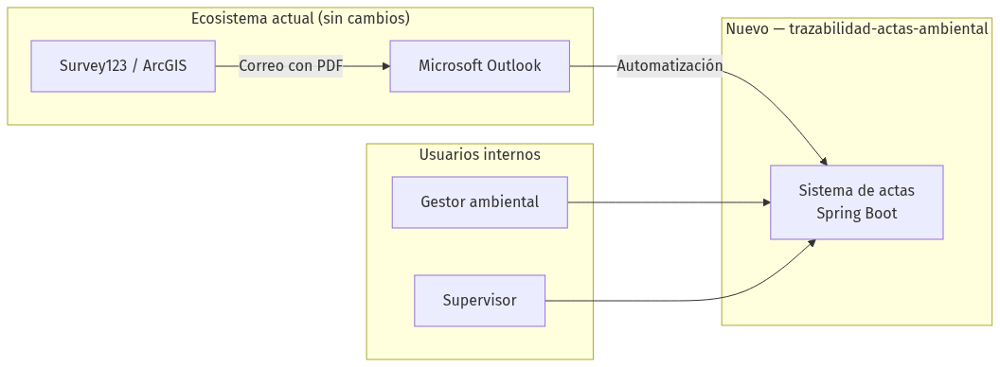
{ width=100% }

### 1.2 Principios de diseño

| Principio | Descripción |
|-----------|-------------|
| **Complementar, no reemplazar** | Survey123 sigue en campo; Outlook sigue recibiendo correos. |
| **Bajo costo** | Stack open source: Java 17, Spring Boot, PostgreSQL, Liquibase. |
| **Evolución por fases** | Registro manual → API → firma/nube automática → SIG. |
| **API-first para integración** | Power Automate y futuros sistemas se conectan vía REST JSON. |
| **Auditoría** | Cada cambio de estado queda en `historial_estados`. |

### 1.3 Arquitectura lógica (capas)

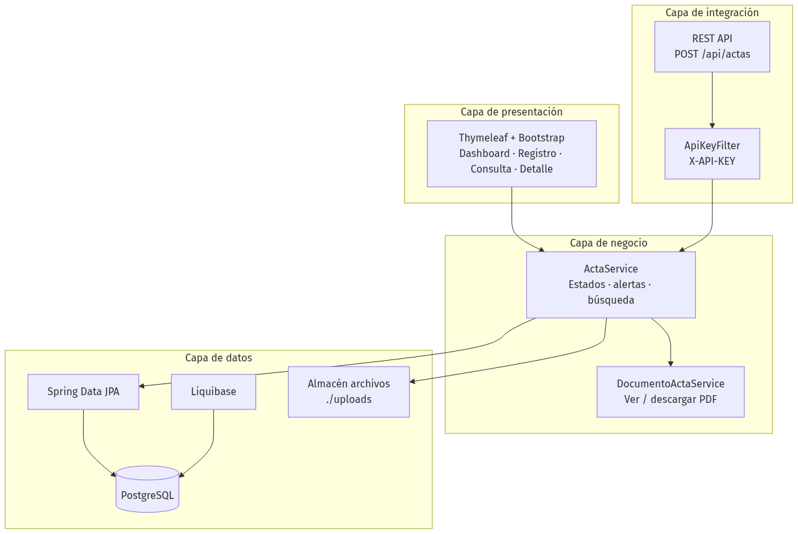
{ width=100% }

| Capa | Responsabilidad | Ubicación en código |
|------|-----------------|---------------------|
| Presentación | Pantallas web para gestores y supervisores | `web/`, `templates/` |
| Integración | API REST para Power Automate y sistemas externos | `api/`, `config/ApiKeyFilter` |
| Negocio | Reglas de flujo, alertas, historial, documentos | `service/` |
| Datos | Persistencia y migraciones de esquema | `repository/`, `model/`, `db/changelog/` |

### 1.4 Arquitectura física — despliegue

#### Opción A: Servidor interno municipal (producción propuesta)

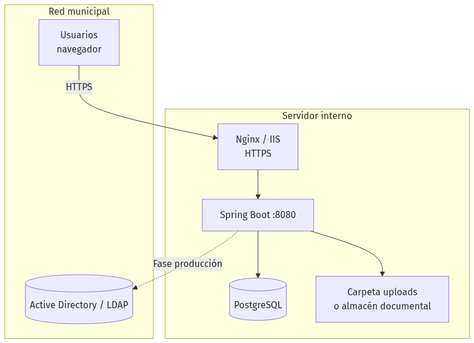
{ width=100% }

#### Opción B: Demo en nube (implementada — AWS)

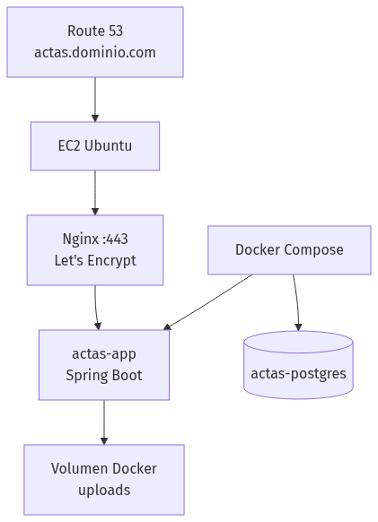
{ width=100% }

| Componente | Tecnología | Notas |
|------------|------------|-------|
| Aplicación | Spring Boot 3.2.5 (JAR embebido) | Perfiles: `demo`, `postgres`, `docker` |
| Base de datos | PostgreSQL 16 | Esquema versionado con Liquibase |
| Archivos | Disco local `./uploads` | PDF/Word; ruta en BD (`ruta_documento`) |
| Proxy / TLS | Nginx + Certbot | Guía: `docs/DESPLIEGUE-AWS.md` |
| Contenedores | Docker Compose | `docker-compose.yml` |

### 1.5 Stack tecnológico

| Capa | Tecnología |
|------|------------|
| Lenguaje | Java 17 |
| Framework | Spring Boot 3.2.5 |
| Web | Thymeleaf, Bootstrap 5, Chart.js |
| API | REST JSON, Jakarta Validation |
| Persistencia | Spring Data JPA, Hibernate |
| BD | PostgreSQL (prod) / H2 (demo) |
| Migraciones | Liquibase |
| Build | Maven |
| Automatización externa | Microsoft Power Automate |
| SIG / campo | Esri Survey123, ArcGIS |

### 1.6 Flujo de estados del documento

Cada transición genera un registro en `historial_estados` (quién, cuándo, observación).

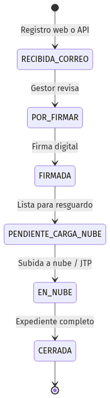
{ width=100% }

### 1.7 Modelo de datos (resumen)

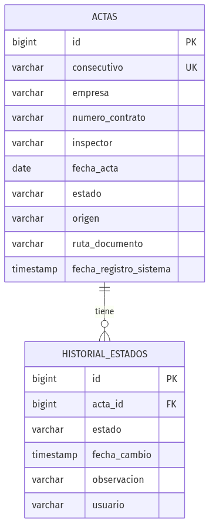
{ width=100% }

---

## 2. Roadmap

Roadmap propuesto en **fases incrementales**, validado con el departamento de Tecnología en cada etapa.

### 2.1 Vista resumida

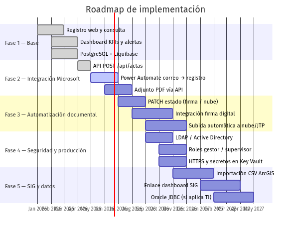
{ width=100% }

> Las fechas son **orientativas** para la presentación; el calendario real lo define Tecnología según prioridades y recursos.

### 2.2 Detalle por fase

| Fase | Objetivo | Entregables | Estado |
|:----:|----------|-------------|--------|
| **1** | Trazabilidad manual centralizada | Web (dashboard, registro, consulta, detalle), BD, adjuntos, historial | **Implementado** |
| **2** | Automatizar registro desde Outlook | `POST /api/actas`, flujo Power Automate, documentación API | **Parcial** (API lista; flujo PA pendiente TI) |
| **3** | Reducir trabajo manual (firma y nube) | `PATCH` estado, conector firma digital, subida SharePoint/JTP | **Propuesto** |
| **4** | Pasar a producción segura | LDAP/AD, roles, HTTPS obligatorio, rotación de secretos | **Propuesto** |
| **5** | Integración SIG y alineación TI | Import ArcGIS, enlace SIG, migración Oracle si aplica | **Propuesto** |

### 2.3 Fase 1 — Base operativa *(completada)*

| Ítem | Descripción |
|------|-------------|
| Registro de actas | Formulario web con adjunto PDF/Word |
| Consulta | Filtros por empresa, contrato, consecutivo, inspector, estado, fechas |
| Dashboard | KPIs, gráficos (estado, tipo, gestor), alertas de pendientes |
| Detalle | Cambio de estado, historial, ver/descargar documento |
| Persistencia | PostgreSQL + Liquibase; empresa y contrato opcionales |
| Demo | Perfil H2 en memoria para demostraciones sin BD |

### 2.4 Fase 2 — Integración Microsoft 365

| Ítem | Descripción | Dependencia TI |
|------|-------------|----------------|
| Power Automate | Trigger: correo nuevo en carpeta Actas → `POST /api/actas` | Licencia M365, cuenta de servicio |
| Mapeo de campos | Extraer consecutivo, empresa, contrato del cuerpo del correo Survey123 | Plantilla de correo actual |
| API key segura | `APP_API_KEY` en Azure Key Vault o gestor de secretos | Política de secretos municipal |
| Adjunto en API | Extender API para recibir PDF desde el flujo (multipart) | Desarrollo + prueba de flujo |

### 2.5 Fase 3 — Automatización firma y nube

| Paso manual actual | Automatización propuesta |
|--------------------|--------------------------|
| Descargar PDF del correo | Power Automate guarda adjunto o API multipart |
| Carpetas locales | Documento en servidor; vista en navegador |
| Firma digital externa | Flujo envía a proveedor de firma → `PATCH` estado `FIRMADA` |
| Subida manual a nube | Power Automate o servicio sube a SharePoint/JTP → `PATCH` estado `EN_NUBE` |
| Renombrar archivo "SUBIDA" | Estado `EN_NUBE` en BD + historial |

### 2.6 Fase 4 — Seguridad y producción

| Control | Demo actual | Producción |
|---------|-------------|------------|
| Login web | Sin autenticación | LDAP / Active Directory |
| Roles | No implementados | Gestor, supervisor, solo lectura |
| API | `X-API-KEY` | OAuth2 / mTLS + Key Vault |
| Transporte | HTTP (local) | HTTPS obligatorio |
| Documentos | Acceso por URL | Permisos por rol |
| Secretos | Valores demo en config | Variables de entorno / Key Vault |

### 2.7 Fase 5 — SIG y alineación con infraestructura municipal

| Ítem | Descripción |
|------|-------------|
| ArcGIS | Importación CSV o Feature Service para cruzar casos de campo |
| Dashboard SIG | Enlace o API GET para consulta desde mapa institucional |
| Oracle | Migración JDBC si TI centraliza en Oracle (JPA facilita el cambio) |
| OTRS / otros | Campo `origen` ya contempla integraciones adicionales vía REST |

### 2.8 Reducción de trabajo manual — antes y después

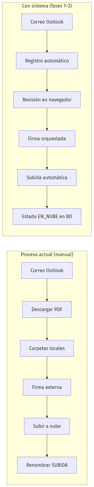
{ width=100% }

---

## 3. Diagrama de integración

### 3.1 Integración end-to-end (actual + futuro)

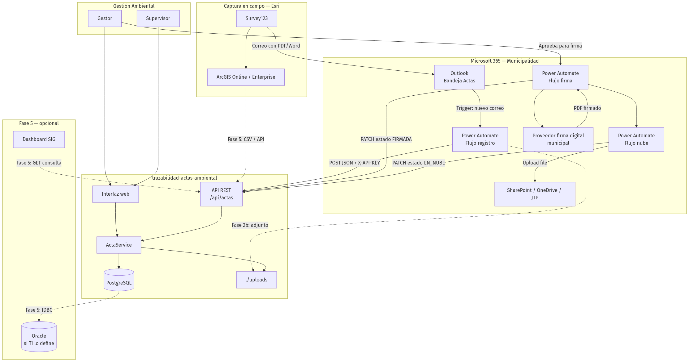
{ width=100% }

### 3.2 Matriz de integración por herramienta

| Herramienta | Rol actual | Integración con el sistema | Mecanismo | Factibilidad |
|-------------|------------|------------------------------|-----------|:------------:|
| **Survey123** | Captura en campo, envía correo | Origen `SURVEY123`; metadatos en registro | Correo → Outlook → Power Automate → API | Alta |
| **ArcGIS** | Almacén espacial de casos | Cruce de referencia / importación | CSV export, Feature Service, REST | Media |
| **Outlook** | Recepción de actas | Disparador de automatización | Power Automate (When email arrives) | Alta |
| **Power Automate** | Automatización M365 | Registro, firma, subida nube | HTTP POST/PATCH + conectores M365 | Alta |
| **SharePoint / JTP** | Resguardo en nube | Destino de PDF firmado | Upload file + actualización de estado | Media–alta |
| **Firma digital** | Validez legal del documento | Orquestación del flujo | API del proveedor municipal | Media–alta |
| **Oracle** | BD corporativa (si aplica) | Persistencia centralizada | JDBC + dialecto Hibernate | Media–alta |
| **Active Directory** | Identidad municipal | Login y roles | Spring Security + LDAP | Alta |

### 3.3 Flujo de integración — Fase 2 (registro automático)

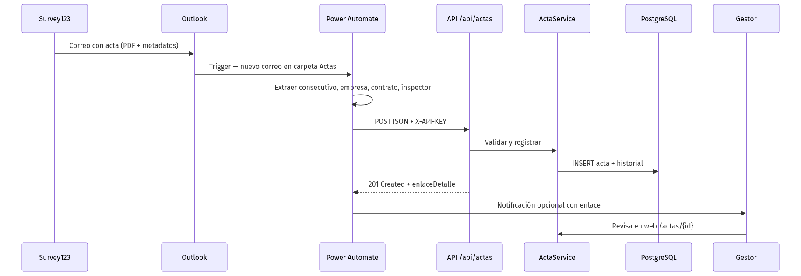
{ width=100% }

### 3.4 Flujo de integración — Fase 3 (firma y nube)

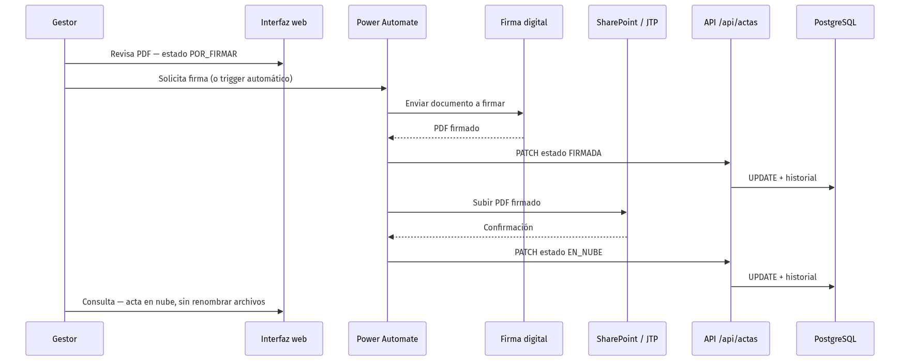
{ width=100% }

### 3.5 Endpoints API — estado de implementación

| Método | Ruta | Uso | Estado |
|--------|------|-----|--------|
| POST | `/api/actas` | Registrar acta desde Outlook / Power Automate | **Implementado** |
| GET | `/api/actas` | Consulta con filtros | Documentado |
| GET | `/api/actas/{consecutivo}` | Detalle por consecutivo | Documentado |
| PATCH | `/api/actas/{consecutivo}/estado` | Actualizar estado (firma, nube) | Documentado |

Documentación detallada: [`docs/API-POWER-AUTOMATE.md`](API-POWER-AUTOMATE.md)

## Referencias

| Documento | Contenido |
|-----------|-----------|
| [`README.md`](../README.md) | Inicio rápido y visión general |
| [`docs/PROPUESTA-ETAPA2-DISENO.md`](PROPUESTA-ETAPA2-DISENO.md) | Propuesta completa Etapa 2 |
| [`docs/API-POWER-AUTOMATE.md`](API-POWER-AUTOMATE.md) | Contrato API y flujos Power Automate |

---

*Municipalidad de Heredia — Gestión Ambiental · Prototipo 0.1.0-DEMO*
