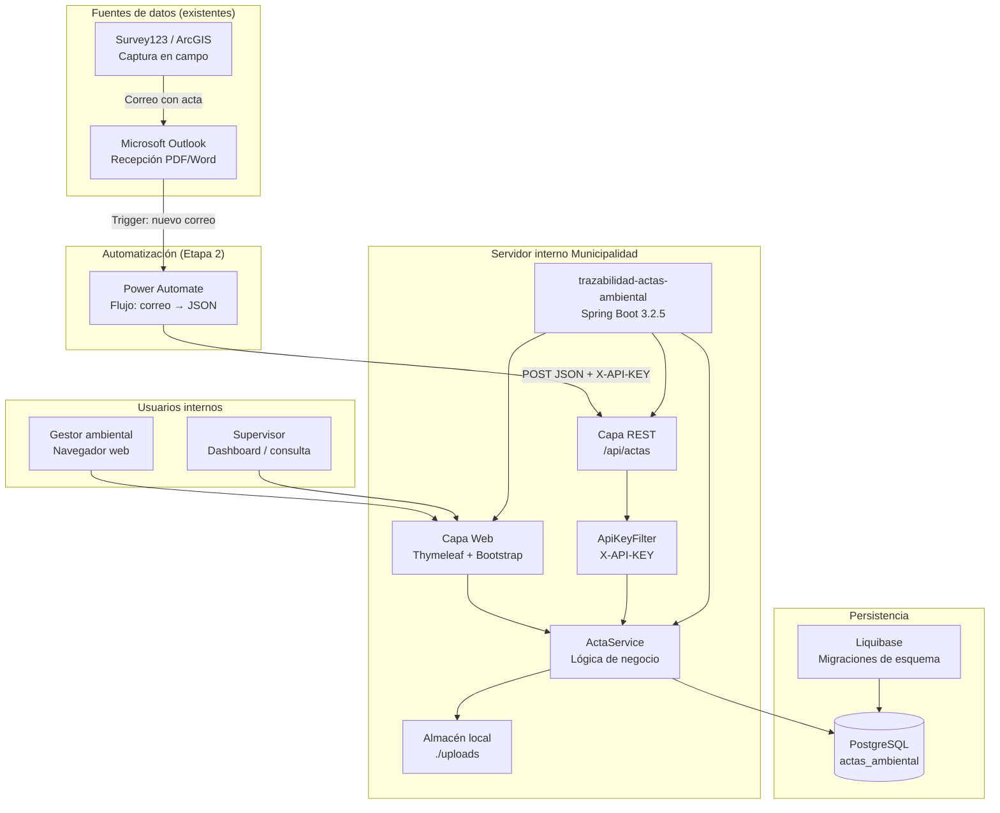
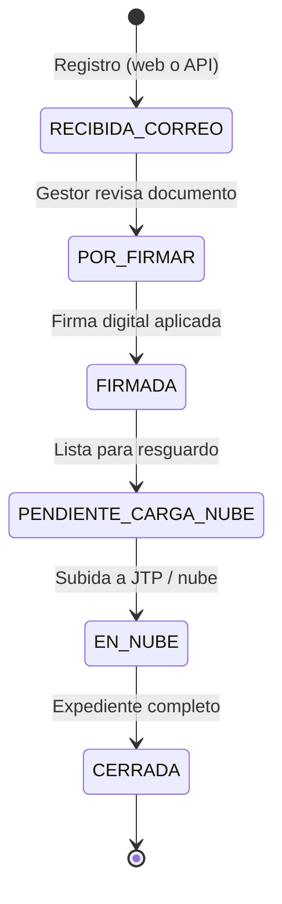
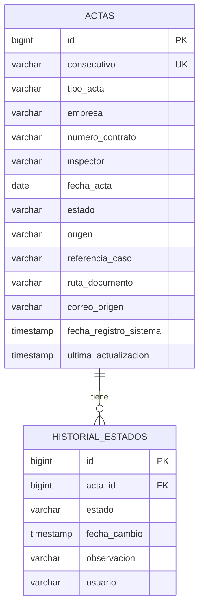

# Propuesta Tecnológica — Etapa 2: Diseño

**Sistema de Trazabilidad y Control Documental de Actas Ambientales**  
**Municipalidad de Heredia — Gestión Ambiental**  
**Repositorio:** `trazabilidad-actas-ambiental`  
**Versión del prototipo:** 0.1.0-DEMO

---

## 1. Contexto y objetivo

### 1.1 Objetivo de la etapa

Diseñar una **propuesta tecnológica viable** que aproveche la infraestructura actual de la Municipalidad **sin requerir inversiones importantes**, cerrando las brechas detectadas en el control y seguimiento de actas ambientales.

### 1.2 Brechas que responde esta propuesta

| Brecha detectada | Solución propuesta |
|------------------|-------------------|
| Actas recibidas por correo sin registro centralizado | Registro web + API REST desde Outlook (Power Automate) |
| Sin trazabilidad del estado documental (firma, nube) | Flujo de 6 estados con historial auditado |
| Dificultad para consultar por empresa o contrato | Módulo de consulta con filtros dinámicos |
| Falta de visibilidad gerencial del avance | Dashboard con KPIs y alertas de pendientes |
| Dependencia de archivos sueltos en carpetas | Metadatos en BD + almacenamiento de documento adjunto |

### 1.3 Enfoque: complementar, no reemplazar

El sistema **no sustituye** las herramientas ya en uso:

| Herramienta existente | Rol que mantiene |
|-----------------------|------------------|
| **Survey123 / ArcGIS** | Captura de datos en campo |
| **Microsoft Outlook** | Canal de recepción del PDF/Word |
| **Power Automate** (Etapa 2) | Automatización correo → registro |
| **Este sistema** | Metadatos, estados, contrato, trazabilidad hasta la nube |

### 1.4 Alcance implementado en el repositorio

| Componente | Estado | Ubicación en el repositorio |
|------------|--------|----------------------------|
| Aplicación web (Thymeleaf + Bootstrap) | Implementado | `src/main/resources/templates/` |
| API REST POST `/api/actas` | Implementado | `src/main/java/.../api/ActaRestController.java` |
| Modelo de datos + migraciones Liquibase | Implementado | `src/main/resources/db/changelog/` |
| Servicio de negocio y trazabilidad | Implementado | `src/main/java/.../service/ActaService.java` |
| Integración PostgreSQL | Implementado | `application.yml` (perfil `postgres`) |
| Demo sin BD externa (H2 en memoria) | Implementado | `application.yml` (perfil `demo`) |
| Documentación API Power Automate | Implementado | `docs/API-POWER-AUTOMATE.md` |
| GET/PATCH API (consulta y cambio de estado) | Documentado, pendiente de implementar | `docs/API-POWER-AUTOMATE.md` |
| Autenticación LDAP / Active Directory | Propuesto (fase producción) | `README.md` |

---

## 2. Arquitectura de la solución

### 2.1 Principios de diseño

- **Bajo costo:** stack open source (Java 17, Spring Boot, PostgreSQL).
- **Reutilización:** aprovecha Outlook, Power Automate y Survey123 ya licenciados en la Municipalidad.
- **Despliegue simple:** aplicación monolítica empaquetable en un servidor interno existente (Tomcat embebido).
- **Evolución gradual:** fases 1 (manual) → 2 (API) → 3 (estados automáticos) → 4 (ArcGIS) → 5 (SIG).

### 2.2 Diagrama de componentes



### 2.3 Capas técnicas del repositorio

```
src/main/java/cr/go/heredia/actas/
├── web/          → Controlador MVC (pantallas web)
├── api/          → Controlador REST (integración Power Automate)
├── service/      → Reglas de negocio, alertas, historial
├── repository/   → Acceso a datos (Spring Data JPA)
├── model/        → Entidades JPA y enumeraciones
├── dto/          → Objetos de transferencia (formularios y API)
└── config/       → Filtro API, carga demo, PostgreSQL auto-create
```

### 2.4 Stack tecnológico

| Capa | Tecnología | Versión |
|------|------------|---------|
| Lenguaje | Java | 17 |
| Framework | Spring Boot | 3.2.5 |
| Vista web | Thymeleaf + Bootstrap | 5.3.3 |
| Persistencia | Spring Data JPA + Hibernate | (BOM Spring Boot) |
| Base de datos | PostgreSQL / H2 (demo) | — |
| Migraciones | Liquibase | (BOM Spring Boot) |
| Validación | Jakarta Bean Validation | — |
| Build | Maven | 3.8+ |

### 2.5 Flujo de estados del acta



Cada transición genera un registro en la tabla `historial_estados` (auditoría).

### 2.6 Roadmap de integración propuesto a TI

| Fase | Integración | Estado |
|------|-------------|--------|
| 1 | Registro manual al recibir correo (web) | Implementado |
| 2 | Power Automate → `POST /api/actas` | Implementado |
| 3 | `PATCH /api/actas/{consecutivo}/estado` al firmar / subir a nube | Documentado |
| 4 | Export CSV ArcGIS → importación | Propuesto |
| 5 | Enlace consulta con dashboard SIG | Propuesto |

---

## 3. Modelo de datos

### 3.1 Diagrama entidad-relación



### 3.2 Tabla `actas`

Definida en Liquibase: `src/main/resources/db/changelog/changes/001-initial-schema.yaml`  
Entidad JPA: `src/main/java/cr/go/heredia/actas/model/Acta.java`

| Campo (propuesta) | Columna en BD | Tipo | Obligatorio | Descripción |
|-------------------|---------------|------|:-----------:|-------------|
| **id** | `id` | BIGINT (PK, autoincrement) | Sí | Identificador interno |
| **consecutivo** | `consecutivo` | VARCHAR(40), UNIQUE | Sí | Número de acta (ej. `2026-010`) |
| **tipo_acta** | `tipo_acta` | VARCHAR(80) | No | Ej. Notificación, Minuta |
| **empresa** | `empresa` | VARCHAR(150) | Sí | Nombre del contratista |
| **contrato** | `numero_contrato` | VARCHAR(60) | Sí | Número de contrato (ej. `CT-2024-018`) |
| **inspector** | `inspector` | VARCHAR(120) | Sí | Inspector o gestor responsable |
| **fecha** | `fecha_acta` | DATE | Sí | Fecha del acta |
| **estado** | `estado` | VARCHAR(30) | Sí | Estado del flujo documental |
| **observaciones** | *(ver nota)* | — | — | Ver tabla `historial_estados` |
| **ruta_documento** | `ruta_documento` | VARCHAR(255) | No | Ruta del PDF/Word adjunto en servidor |

**Campos adicionales del diseño (valor agregado):**

| Columna | Tipo | Descripción |
|---------|------|-------------|
| `origen` | VARCHAR(20) | SURVEY123, PORTAL_MUNICIPAL, OTRS, MANUAL |
| `referencia_caso` | VARCHAR(255) | Descripción del caso o incidencia |
| `correo_origen` | VARCHAR(120) | Correo de Outlook que originó el acta |
| `fecha_registro_sistema` | TIMESTAMP | Cuándo se registró en el sistema |
| `ultima_actualizacion` | TIMESTAMP | Último cambio de estado o datos |

> **Nota sobre observaciones:** En el diseño implementado, las observaciones no se almacenan como campo fijo en `actas`, sino en la tabla **`historial_estados`** (`observacion`), lo que permite registrar una observación por cada cambio de estado y mantener trazabilidad completa.

### 3.3 Tabla `historial_estados` (trazabilidad / seguimiento)

| Columna | Tipo | Descripción |
|---------|------|-------------|
| `id` | BIGINT (PK) | Identificador del evento |
| `acta_id` | BIGINT (FK → actas) | Acta relacionada |
| `estado` | VARCHAR(30) | Estado registrado en ese momento |
| `fecha_cambio` | TIMESTAMP | Fecha y hora del cambio |
| `observacion` | VARCHAR(255) | Comentario del cambio |
| `usuario` | VARCHAR(80) | Usuario o sistema que realizó el cambio |

### 3.4 Valores permitidos — `estado`

Definidos en `src/main/java/cr/go/heredia/actas/model/EstadoActa.java`:

| Código | Etiqueta visible |
|--------|------------------|
| `RECIBIDA_CORREO` | Recibida por correo |
| `POR_FIRMAR` | Por firmar |
| `FIRMADA` | Firmada digitalmente |
| `PENDIENTE_CARGA_NUBE` | Pendiente carga en nube |
| `EN_NUBE` | Almacenada en nube |
| `CERRADA` | Cerrada / expediente completo |

### 3.5 Valores permitidos — `origen`

Definidos en `src/main/java/cr/go/heredia/actas/model/OrigenActa.java`:

`SURVEY123` · `PORTAL_MUNICIPAL` · `OTRS` · `MANUAL`

### 3.6 Gestión del esquema

Las migraciones se versionan con **Liquibase**:

```
src/main/resources/db/
└── changelog/
    ├── db.changelog-master.yaml
    └── changes/
        └── 001-initial-schema.yaml
```

Hibernate opera en modo `validate` (no modifica el esquema; Liquibase es la fuente de verdad).

---

## 4. Mockups — Pantallas del sistema

Las pantallas son **prototipos funcionales** implementados con Thymeleaf y Bootstrap 5.  
Paleta institucional: verde `#1b5e20`. Navegación común en barra superior.

### 4.1 Dashboard de seguimiento

**Ruta:** `/dashboard`  
**Archivo:** `src/main/resources/templates/dashboard.html`  
**Controlador:** `ActaController.dashboard()`

```
┌─────────────────────────────────────────────────────────────────────┐
│  Gestión Ambiental — Actas          Dashboard | Registrar | Consulta│
├─────────────────────────────────────────────────────────────────────┤
│  Dashboard de seguimiento                        [+ Registrar acta] │
│  Prototipo — Trazabilidad y control documental                      │
│                                                                     │
│  ┌──────────────┐ ┌──────────────┐ ┌──────────────┐ ┌─────────────┐ │
│  │ RECIBIDA_    │ │ POR_FIRMAR   │ │ FIRMADA      │ │ EN_NUBE     │ │
│  │ CORREO       │ │              │ │              │ │             │ │
│  │     3        │ │     1        │ │     2        │ │     0       │ │
│  └──────────────┘ └──────────────┘ └──────────────┘ └─────────────┘ │
│  (tarjetas KPI por cada estado del flujo)                            │
│                                                                     │
│  ⚠ Alertas — pendientes de firma o carga                            │
│  ┌───────────────────────────────────────────────────────────────┐  │
│  │ Consecutivo │ Empresa        │ Contrato     │ Estado    │ Ver │  │
│  │ 2026-003    │ EcoHeredia S.A.│ CT-2024-018  │ Por firmar│ →   │  │
│  └───────────────────────────────────────────────────────────────┘  │
│                                                                     │
│  ℹ Demo: Simula el registro cuando llega un acta por correo.       │
└─────────────────────────────────────────────────────────────────────┘
```

**Funcionalidad:**
- Contadores (KPI) por cada estado del flujo.
- Tabla de **alertas** para actas con más de 3 días en `POR_FIRMAR` o más de 5 días en `FIRMADA` / `PENDIENTE_CARGA_NUBE`.
- Acceso rápido al registro de nuevas actas.

---

### 4.2 Registro de actas

**Ruta:** `/actas/nueva` (GET) · `/actas` (POST)  
**Archivo:** `src/main/resources/templates/registro.html`

```
┌─────────────────────────────────────────────────────────────────────┐
│  Gestión Ambiental — Actas                    Dashboard | Consulta  │
├─────────────────────────────────────────────────────────────────────┤
│  Registro de acta                                                   │
│  Use cuando el acta llegue por Outlook (Survey123 o portal).        │
│                                                                     │
│  ┌─────────────────────────────────────────────────────────────┐    │
│  │ Consecutivo *    │ Empresa *         │ N.º contrato *       │    │
│  │ [2026-005      ] │ [EcoHeredia S.A.] │ [CT-2024-018       ] │    │
│  │                                                               │    │
│  │ Inspector *      │ Fecha acta *      │ Estado *             │    │
│  │ [Josue M.      ] │ [2026-06-15    ] │ [Recibida por correo▼]│   │
│  │                                                               │    │
│  │ Origen *         │ Tipo de acta      │ Correo origen        │    │
│  │ [SURVEY123     ▼]│ [Notificación  ] │ [sostenible@...    ] │    │
│  │                                                               │    │
│  │ Referencia / caso                                             │    │
│  │ [Incumplimiento ruta Guararí                               ] │    │
│  │                                                               │    │
│  │ Adjuntar PDF/Word (opcional)                                  │    │
│  │ [ Elegir archivo... ]                                         │    │
│  │                                                               │    │
│  │ Observación inicial                                           │    │
│  │ [Recibida en bandeja Outlook 09:15                         ] │    │
│  │                                                               │    │
│  │ [ Guardar acta ]  [ Cancelar ]                                │    │
│  └─────────────────────────────────────────────────────────────┘    │
└─────────────────────────────────────────────────────────────────────┘
```

**Funcionalidad:**
- Formulario con validación de campos obligatorios.
- Carga opcional de documento (PDF/Word, máx. 15 MB) al directorio `./uploads`.
- Al guardar: crea el acta y el primer registro en `historial_estados`.
- Equivalente API: `POST /api/actas` (integración Power Automate).

---

### 4.3 Consulta de actas

**Ruta:** `/actas/consulta`  
**Archivo:** `src/main/resources/templates/consulta.html`

```
┌─────────────────────────────────────────────────────────────────────┐
│  Gestión Ambiental — Actas              Dashboard | Registrar       │
├─────────────────────────────────────────────────────────────────────┤
│  Consulta de actas                                                  │
│                                                                     │
│  ┌─ Filtros ────────────────────────────────────────────────────┐   │
│  │ Empresa        │ Contrato       │ Consecutivo  │ Inspector   │   │
│  │ [EcoHeredia  ] │ [CT-2024-018 ] │ [          ] │ [         ] │   │
│  │ [ Buscar ]  [ Limpiar ]                                        │   │
│  └────────────────────────────────────────────────────────────────┘   │
│                                                                     │
│  ┌─ Resultados ───────────────────────────────────────────────────┐   │
│  │ Consec. │ Empresa       │ Contrato    │ Insp. │ Fecha │Estado│   │
│  │ 2026-010│ EcoHeredia S.A│ CT-2024-018 │ Josue │06-15  │ ●    │Det│
│  │ 2026-008│ Verde CR Ltda │ CT-2023-042 │ Ana M.│05-20  │ ●    │Det│
│  └────────────────────────────────────────────────────────────────┘   │
└─────────────────────────────────────────────────────────────────────┘
```

**Funcionalidad:**
- Búsqueda parcial (contiene) por empresa, contrato, consecutivo e inspector.
- Tabla de resultados con enlace al detalle/seguimiento.
- Equivalente API planificado: `GET /api/actas?empresa=...&numeroContrato=...`

---

### 4.4 Seguimiento (detalle + historial)

**Ruta:** `/actas/{id}`  
**Archivo:** `src/main/resources/templates/detalle.html`

```
┌─────────────────────────────────────────────────────────────────────┐
│  Gestión Ambiental — Actas                                          │
├─────────────────────────────────────────────────────────────────────┤
│  Acta 2026-010                                    [ Volver ]          │
│                                                                     │
│  ┌─ Datos del acta ──────────────┐  ┌─ Cambiar estado ────────────┐ │
│  │ Empresa    EcoHeredia S.A.    │  │ [Firmada digitalmente    ▼] │ │
│  │ Contrato   CT-2024-018        │  │ [Observación del cambio   ] │ │
│  │ Inspector  Josue M.           │  │ [ Actualizar estado      ] │ │
│  │ Fecha      2026-06-15         │  └─────────────────────────────┘ │
│  │ Estado     ● Recibida correo  │                                  │
│  │ Origen     SURVEY123          │  ┌─ Historial ─────────────────┐ │
│  │ Tipo       Notificación       │  │ 06/06/2026 16:11            │ │
│  │ Correo     sostenible@...     │  │ ● Recibida por correo         │ │
│  │ Documento  ./uploads/2026...  │  │ Registro desde API            │ │
│  └───────────────────────────────┘  │ Por: integracion.outlook      │ │
│                                     │ ───────────────────────────── │ │
│                                     │ 06/06/2026 09:00              │ │
│                                     │ ● Por firmar                  │ │
│                                     │ Enviada a revisión            │ │
│                                     │ Por: gestor.ambiental         │ │
│                                     └───────────────────────────────┘ │
└─────────────────────────────────────────────────────────────────────┘
```

**Funcionalidad:**
- Vista completa de metadatos del acta.
- Panel para **cambiar estado** con observación (genera entrada en historial).
- **Historial cronológico** de todos los cambios (fecha, estado, observación, usuario).
- Ruta del documento adjunto cuando existe.

---

## 5. API REST — Integración Etapa 2

Documentación completa: [`docs/API-POWER-AUTOMATE.md`](API-POWER-AUTOMATE.md)

### Endpoint implementado

```
POST /api/actas
Header: X-API-KEY: demo-api-key-heredia
Content-Type: application/json
```

**Ejemplo de cuerpo:**

```json
{
  "consecutivo": "2026-010",
  "empresa": "EcoHeredia S.A.",
  "numeroContrato": "CT-2024-018",
  "inspector": "Josue M.",
  "fechaActa": "2026-06-15",
  "origen": "SURVEY123",
  "estado": "RECIBIDA_CORREO",
  "observacionHistorial": "Registro desde API - simula Power Automate"
}
```

**Respuesta:** `201 Created` con metadatos del acta y enlace al detalle web.

---

## 6. Seguridad y despliegue propuesto

| Aspecto | Demo actual | Producción propuesta |
|---------|-------------|---------------------|
| Autenticación web | Sin login (demo) | LDAP / Active Directory |
| Autenticación API | Cabecera `X-API-KEY` | OAuth2 / mTLS + Key Vault |
| Transporte | HTTP local | HTTPS obligatorio |
| Documentos | Carpeta `./uploads` | Almacén con permisos por rol |
| Auditoría | Tabla `historial_estados` | + logs centralizados TI |
| Base de datos | PostgreSQL local | Servidor PostgreSQL municipal |

### Perfiles de ejecución

| Perfil | Uso | Comando |
|--------|-----|---------|
| `demo` | Demostración sin PostgreSQL (H2 en memoria) | `mvn spring-boot:run -Dspring-boot.run.profiles=demo` |
| `postgres` | Desarrollo / producción con PostgreSQL | `mvn spring-boot:run` |

---

## 7. Conclusión — Viabilidad de la propuesta

Esta propuesta cumple el objetivo de la Etapa 2 porque:

1. **Aprovecha infraestructura existente:** Outlook, Power Automate, Survey123 y un servidor interno con PostgreSQL.
2. **Inversión mínima:** software 100 % open source; no requiere licencias adicionales de SIG ni reemplazo de herramientas.
3. **Entregables concretos:** prototipo funcional con pantallas, API, modelo de datos versionado y documentación técnica.
4. **Escalable por fases:** registro manual → automatización → integración SIG, sin rediseño arquitectónico.
5. **Cierra brechas operativas:** trazabilidad, consulta por contrato, alertas y auditoría documental.

---

## 8. Referencias del repositorio

| Recurso | Ruta |
|---------|------|
| README general | `README.md` |
| API Power Automate | `docs/API-POWER-AUTOMATE.md` |
| Configuración | `src/main/resources/application.yml` |
| Esquema BD (Liquibase) | `src/main/resources/db/changelog/` |
| Entidad Acta | `src/main/java/cr/go/heredia/actas/model/Acta.java` |
| Pantallas web | `src/main/resources/templates/` |
| Controlador REST | `src/main/java/cr/go/heredia/actas/api/ActaRestController.java` |

---

*Documento generado a partir del repositorio `trazabilidad-actas-ambiental` — Etapa 2: Diseño de la Propuesta.*
